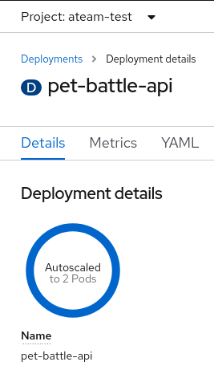
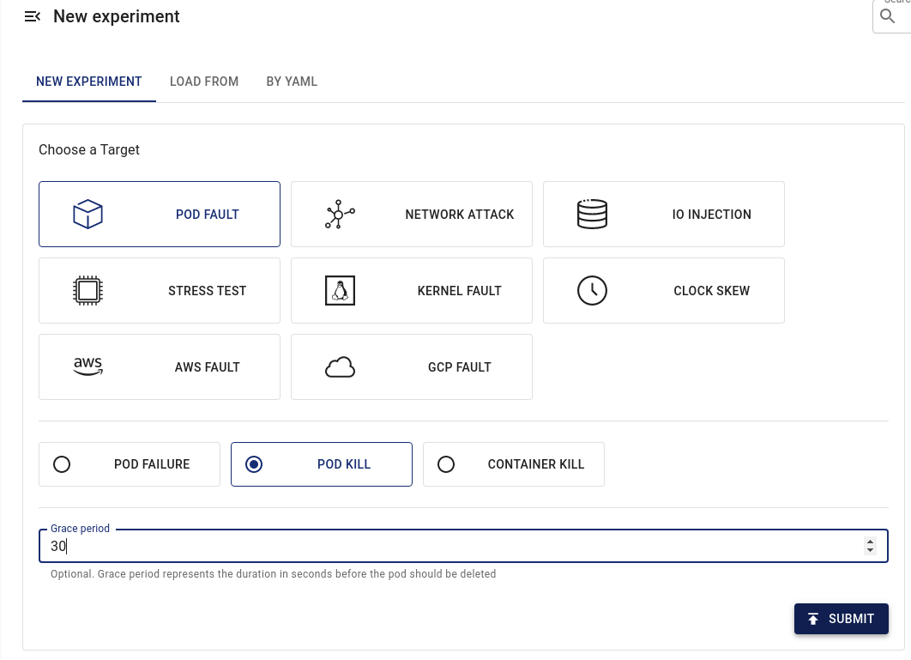
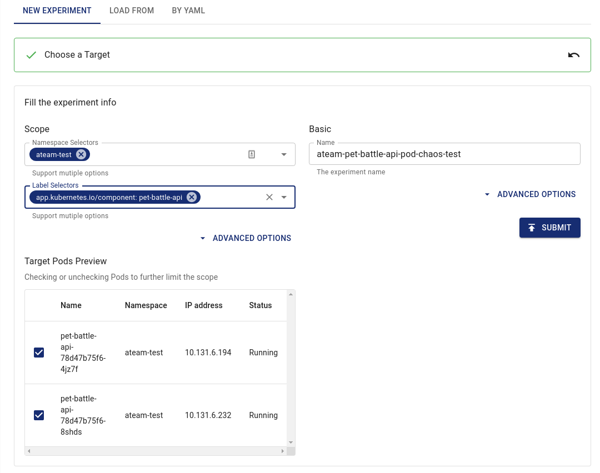
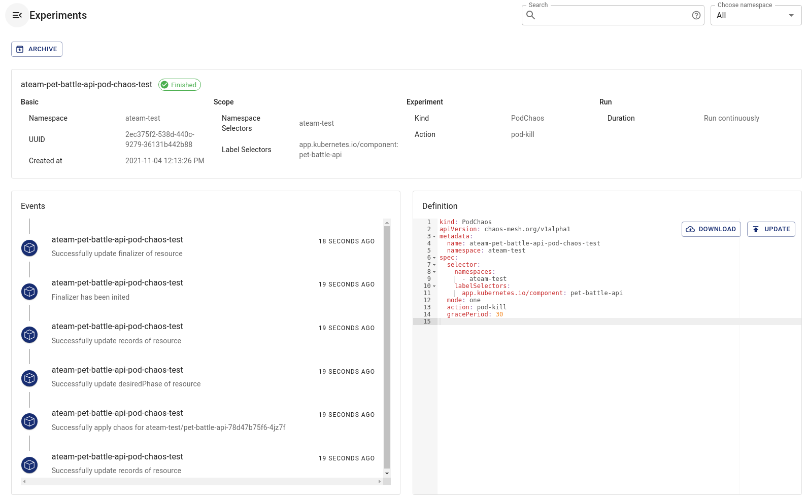
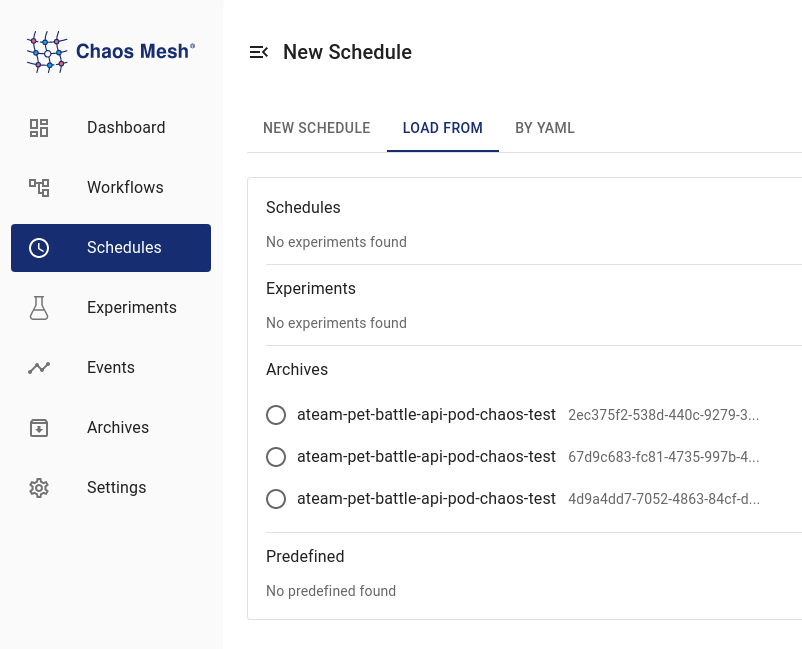
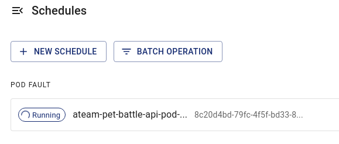

## Chaos Failure Testing - Pods

> In teams, run some chaos tests on your applications, check their responses and mitigate any failures found.

### Killing Pods

Lets write out first chaos experiment. Our application architecture includes a highly available API layer. A quick glance at the `pet-battle-api` deployment in our <TEAM_NAME>-test project, reveals two pods with horizontal pod autoscaling enabled.



To learn a bit about the tooling, we will start by setting up a single experiment that randomly kills our api pods using the web-ui.

You can read more about [single experiments here](https://chaos-mesh.org/docs/define-chaos-experiment-scope/) and in particular [pod fault experiments here.](https://chaos-mesh.org/docs/simulate-pod-chaos-on-kubernetes/)

1. Create a `New Experiment`.

    

2. Use `Pod Fault` with a threshold, click `Submit`.

    

3. Choose the `Namespace` and pod `Label Selectors`, click `Submit`.

    

4. Before the final step, open a shell or use the OpenShift web-ui to observe `pet-battle-api` pods in your project:

    ```bash
    watch oc get pods -lapp.kubernetes.io/name=pet-battle-api -n <TEAM_NAME>-ci-cd
    ```

    <div class="highlight" style="background: #f7f7f7">
    <pre><code class="language-bash">
    NAME                              READY   STATUS    RESTARTS   AGE
    pet-battle-api-56d595fd85-jhhzx   1/1     Running   0          21m
    pet-battle-api-56d595fd85-sphpd   1/1     Running   0          21m
    </code></pre></div>

4. Click `Submit` when all steps complete.

    

5. The experiments should run. Observe a pod being killed and restarted.

    

    <div class="highlight" style="background: #f7f7f7">
    <pre><code class="language-bash">
    NAME                              READY   STATUS              RESTARTS   AGE
    pet-battle-api-56d595fd85-jnmbq   1/1     Running             0          26m
    pet-battle-api-56d595fd85-s7vsm   0/1     ContainerCreating   0          1s
    pet-battle-api-56d595fd85-sphpd   1/1     Terminating         0          26m
    </code></pre></div>

6. You can `Archive` this experiment, then re-create it if you to run it again.

### Schedule The Experiment

1. Lets run the pod fault experiment we created above on a schedule. Select `Schedule` -> `Load From` and select one of your `<TEAM_NAME>-pet-battle-api-pod-chaos-test` runs.

    

2. Use the `cron` format to run the pod fault experiment every 3 minutes (for example).

    

3. `Submit` all the steps. Your experiment will now run on a Schedule.

    

🪄OBSERVE EXPERIMENT RUNNING :D - A random pet battle api pod will be killed every 3 minutes. Observe if the pet battle application still works OK during disruption. 🪄

- How did you test disruption of pet battle ?